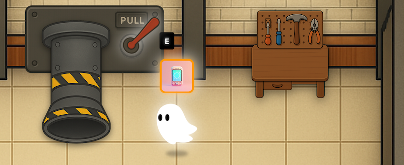

## Overview

In this workshop, you will learn how to use Kiro by completing tasks in the codebase for a sample video game called **Spirit of Kiro**.  

Kiro is an Agentic IDE built by AWS and is the first IDE to offer a complete Spec Driven approach to developing code with AI. 

**You do not need any prior experience with Kiro or any of the technologies we are working with in this workshop - this is a beginner friendly workshop**

## What You'll Learn

- **Vibe Coding vs Spec-Driven Development** - Understand Kiro's two powerful modes and when to use each:
  - Vibe Coding for quick iterations, bug fixes, and exploratory work
  - Spec-Driven Development for complex features requiring planning and structure
- **Kiro's Agentic AI capabilities** - Experience how Kiro's AI agent autonomously understands, plans, and executes complex coding tasks
- **AI-Assisted Debugging** - Use Kiro to identify and fix bugs in an existing codebase
- **Feature Development with AI** - Add new features to the game by collaborating with Kiro's AI
- **Effective AI Collaboration** - Discover how to communicate with AI to get the results you want

## What to Bring

1. Your laptop - fully prepared for the Workshop (see next section)
2. Your Friends - AWS Meetups are more fun with friends, but you can also make friends at the Meetup!
3. A Sense of Adventure!  Kiro is an awesome tool and I can't wait to introduce you all!

## Prerequisites

1. Download and install the Kiro IDE from [kiro.dev](https://kiro.dev/downloads)
2. Download and install either [Docker Desktop](https://www.docker.com/products/docker-desktop/) or [Podman](https://podman.io/) so we can run the game server locally.
3. An AWS account, [credentials to access that AWS account](https://docs.aws.amazon.com/cli/latest/userguide/getting-started-prereqs.html), and [`aws` CLI](https://docs.aws.amazon.com/cli/latest/userguide/cli-chap-getting-started.html) with us-east-1 region enabled (should be by default).
4. AWS Bedrock access to the following models in US-EAST-1 region:
   - One or more of:
	      - Amazon Nova Pro
	      - Anthropic Claude Sonnet 3.7
	      - Anthropic Claude Sonnet 4
   - Amazon Titan Text Embeddings v2 (only if you want to generate item images yourself)
   - Amazon Nova Canvas (only if you want to generate item images yourself)

**Note:**  For Anthropic models, some first-time users may need to submit use case details before they can access Claude models.  This access may take time to process so recommend doing this ahead of the workshop to save time.

## Workshop Materials

All workshop materials, code samples, and exercises are available on GitHub.

*A cartoon ghost stands in front of a large industrial lever labeled "PULL" and a workbench with tools. The ghost is next to a glowing card and a prompt showing the "E" key.*

Spirit of Kiro is an infinite crafting game in which you can:

1. Discover unique, randomly generated objects
2. Utilize these items on each other via simulated interactions like "cut", "paint", "glue", "enchant". Item's combine, break apart, and change in response to these interactions.
3. Sell your resulting creations to an AI appraiser.

Every object in the game is generated by AI. Interactions between objects are also simulated by AI. This gives Spirit of Kiro infinite replayability and potential.  

[View Workshop Repository →](https://github.com/kirodotdev/spirit-of-kiro)